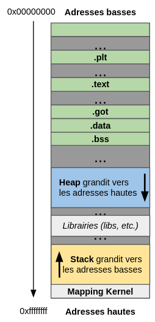
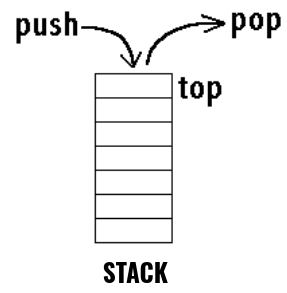

# Reverse

<u>Objectif</u>: comprendre la **gestion de la mémoire** lors de **l'exécution d'un programme**.

De nos jours, les systèmes d'exploitation que nous utilisons sont dits **multi-tâches** car il leur est possible d'exécuter plusieurs processus en parallèle.

Il faut savoir que lorsqu'un processus est exécuté, il ne manipule pas directement la mémoire physique de l'ordinateur.

En effet, les processus sont placés dans des **sandbox** _("bac à sable" en français)_ auxquelles sont affectées des adresses de **mémoire virtuelle** _(2 * 32 -1 = 4 Go pour 32 bits)_.

Ceci permet au **kernel** _(noyau)_ de superviser l'accès à la mémoire physique de l'ordinateur et ainsi d'éviter les conflits de lecture/écriture.

> Ce méchanisme se fait par le biais de [_Page table_](https://en.wikipedia.org/wiki/Page_table). **Note**: Une partie de l'espace virtuel de chaque programme est réservée pour le mapping du kernel.

## Segmentation de la mémoire

Segment              | Description
---------------------|--------------------------------------------------------------------------------------------------------------------------
**.text**             | segment de taille fixe, accessible en lecture seule, contient le "code" du programme _(instructions en langage machine)_. 
**.data**             | segment de taille fixe, accessible en lecture/écriture, contient les **variables globales initialisées**.
**.bss**              | segment de taille fixe, accessible en lecture/écriture, contient les **variables globales non initialisées**.
**heap** _("tas")_   | contient les **variables allouées dynamiquement** via les fonctions type `malloc`, `calloc` ou encore `realloc`.
**stack** _("pile")_ | zone de stockage temporaire contenant les **variables locales** ainsi que les **arguments des fonctions**. 

> Il existe d'autres segments tels que **.got** et **.plt** par exemple.

Ci-dessous un schéma récapitulatif de l'image d'un programme _(compilé)_ dans la mémoire:



Sur Linux, il est d'ailleurs possible de lister la taille des segments ainsi que la taille totale d'un fichier binaire via la commande `size`:

1. programme sans variable:
    ```c
    void main() {

    }
    ```
    + retour de la commande `size`:
        ```bash
        amir@os:~/examples$ gcc prog.c -o prog
        amir@os:~/examples$ size prog
        text	   data	    bss	    dec	    hex	filename
        1418	    544	      8	   1970	    7b2	prog        
        ```

2. programme avec variable globale initialisée:
    ```c
    int globalData = 42;
    void main() {
    }
    ```
    + retour de la commande `size`:
        ```bash
        amir@os:~/examples$ gcc prog.c -o prog
        amir@os:~/examples$ size prog
        text	   data	    bss	    dec	    hex	filename
        1418	    548	      4	   1970	    7b2	prog
        ```
> On constate que par rapport au test n°**1**, le segment _data_ passe de 544 à 548 _(soit 4 octets la taille d'un `int`)_. La taille du segment _text_ ne change pas, car ce dernier ne stocke pas les variables. _Bizaremment le segment bss diminue..._ :hushed:

3. Si on ajoute maintenant un variable globale non initialisée: 
    ```c
    int globalData = 42;
    int globalBss;
    void main() {
    }
    ```
    + retour de la commande `size`:
        ```bash
        amir@os:~/examples$ gcc prog.c -o prog
        amir@os:~/examples$ size prog
        text	   data	    bss	    dec	    hex	filename
        1418	    548	     12	   1978	    7ba	prog
        ```
> On observe que la taille du segment _bss_ a effectivement augmentée.

## Fonctionnement de la "Stack" _(pile)_

La Stack est dite "**LIFO**" _(**L**ast **I**n **F**irst **O**ut)_ ou "**FILO**" _(**F**irst **I**n **L**ast **O**ut)_. Deux opérations sont possibles:

1. **`push`** qui consiste à placer un élément au dessus de la pile _(empiler)_.
2. **`pop`** pour retirer l'élément au dessus de la pile _(dépiler)_.

> _Imaginer une pile d'assiettes._



>  La **_stack frame_** (ou le _bloc d'activation_) d'une fonction est une zone mémoire dans la Stack pour laquelle sont enregistrées toutes les informations nécessaires à l'appel de cette fonction (variables locales notamment).

## Un point sur les registres

_Les registres sont des emplacements mémoire qui sont à l'intérieur du processeur._ Ils se situent au sommet de la <u>hiérarchie mémoire</u> _(voir figure ci-dessous)_ et constituent la mémoire la plus rapidement accessible par le processeur. Pour un ordre d'idée:


## x86 Assembly

### Registres généraux du processeur x86

Registre  | Description
----------|-------------------
`EAX`     | **A**ccumulateur stocke le code de retour des fonctions (_+ des valeurs en général_)
`ECX`     | **C**ompteur que l'on incrémente _(dans les boucles `for` par exemple)_
`EDX`     | **D**onnées pour les opérations d'entrées/sorties
`EBX`     | **B**ase &rarr; pointeur de données
`ESI`     | **I**ndex de **S**ource
`EDI`     | **I**ndex de **D**estination
`EFLAGS`  | Drapeaux pour les tests _(comparaison etc.)_
**`EIP`** | Pointeur d'**I**nstruction (adresse de l'instruction que le processeur doit exécuter)
**`EBP`** | Pointeur de **B**ase "censé" pointé vers le bas de la Stack _(en réalité &rarr;  début de la stackframe)_
**`ESP`** | Pointeur vers le haut de la **S**tack (évolue constamment)

_La stack frame courante (bloc d'activation) est délimitée par les adresses contenues dans `EBP` et `ESP`:_


**Comment le processeur revient-il à l'état précédent ?**

> **Rappel**: chaque fonction a sa propre _stack frame_.

Pour chaque fonction, le compilateur génère:

- un **prologue** qui <u>sauvegarde les informations de la fonction appelante</u> et <u>réserve de l'espace sur la stack pour les besoins de la fonction</u> _(variables locales etc.)_.

> Avant l'appel d'une fonction, les arguments puis le registre `EIP` sont placés sur la stack. Ensuite, c'est au tour d'`EBP` d'être **push**. Enfin, `ESP` est écrasé avec la valeur d'`EBP` afin de créer la _stack frame_ de la fonction appelé.

- et un **épilogue** qui s'occupe de <u>restituer ces informations sauvegardées pour que la fonction appelante puisse reprendre son cours d'exécution</u>.

> Lorsqu'on <u>désassemble</u> une fonction _(avec `gdb` ou `objdump` par exemple)_, les deux dernières instructions sont `pop ebp` et `ret`. `pop ebp` permet de placer `EBP` sur le début de la _stack frame_ de la fonction appelante. `ret` revient à `pop eip` _(qu'on avait **push** au début lors de l'appel à la fonction)_ pour placer `EIP` à l'instruction qui se trouve après l'appel de la fonction.

Pour résumer:


_L'instruction assembleur pour appeler une fonction `call` équivaut à placer `EIP` sur la stack et se rendre à l'adresse de la fonction:_

```nasm
push EIP
jmp <adresse de la fonction>
```

### Opérations classiques

- `mov`
- `add` 
- `sub` 
- `lea`
- `cmp` 

### Contrôle de flux _(Control flow)_

- `call <address>`: appel de fonction. Alias de:

```nasm
push EIP
jmp <adresse de la fonction>
```

- `jmp <address>`: saut inconditionnel. _Similaire à_ `mov eip,<address>`
- `je <address>`: saut conditionnel (_Si égal alors va à cette adresse_)
- `jne` 
- `jz` 
- `beq` 

## x64 Assembly

## `(GDB)`

## ARM Assembly


## Tools

> [Which RE tool should I choose?](https://www.reddit.com/r/securityCTF/comments/curt1f/which_re_tool_should_i_choose_radare_vs_ghidra/) _You can NEVER have too many tools in your tool belt. You'll also find over time that certain tools do certain things better sometimes._

### Static

- [**IDA**](https://www.hex-rays.com/products/ida/):
- [**Ghidra**](https://ghidra-sre.org/):
- [**Radare2**/**cutter**](https://www.radare.org/n/):
- [**Binary Ninja**](https://binary.ninja/):
- [**Hopper**](https://www.hopperapp.com/):
- [**x64dbg**](https://x64dbg.com/):
- [**OllyDbg**](http://www.ollydbg.de/):
- [**WinDBG**](http://www.windbg.org/):


### Dynamic

- [**arm_now**](https://github.com/nongiach/arm_now):
- [PEDA](https://github.com/longld/peda) _(`gdb` plugin)_:

## Ressources

- [**Hackndo** - Gestion de la mémoire](https://beta.hackndo.com/memory-allocation/)
- [**Hackndo** - Fonctionnement de la pile](https://beta.hackndo.com/stack-introduction/)
- [**Hackndo** - Assembleur _(notions de base)_](https://beta.hackndo.com/assembly-basics/)
- [**Hackndo** - Introduction à gdb](https://beta.hackndo.com/introduction-a-gdb/)
- [**Hackndo** - Fonctionnement de la pile](https://beta.hackndo.com/stack-introduction/)


- [**N0fix** - Reverse engineering et exploitation de binaires](https://github.com/N0fix/reverseIntro#veille-cyberd%C3%A9fense---victorien-blanchard)
- [**Microsoft** - RAM, mémoire virtuelle, fichier d'échange et gestion de la mémoire dans Windows](https://support.microsoft.com/fr-fr/help/2160852/ram-virtual-memory-pagefile-and-memory-management-in-windows)
- [**stackoverflow** - what is kernel mapping in linux?](https://stackoverflow.com/questions/53301388/what-is-kernel-mapping-in-linux)
- [**aldeid** Wiki - x86-assembly](https://www.aldeid.com/wiki/Category:Architecture/x86-assembly)
- [**Intel** - Advanced Computer Concepts for the (Not So) Common Chef: Memory Hierarchy: Of Registers, Cache & Memory](https://software.intel.com/en-us/blogs/2015/06/11/advanced-computer-concepts-for-the-not-so-common-chef-memory-hierarchy-of-registers)
- [**Ophir Harpaz** - Reverse Engineering for Beginners](https://www.begin.re/)

- [Reversing the VKSI2000 Hand-Held Trading Device by **FOX PORT** ](https://sockpuppet.org/issue-79-file-0xb-foxport-hht-hacking.txt.html)

- [**Sébastien Mériot** - Introduction à l'analyse des malwares](https://www.youtube.com/watch?v=hUdSp-kz_xI)
- [**HackerSploit** - Malware Analysis](https://www.youtube.com/playlist?list=PLBf0hzazHTGMSlOI2HZGc08ePwut6A2Io)
- [RTFM SigSegv1 - Analyse du Malware TinyNuke](https://youtu.be/K44tl9NMop0)
