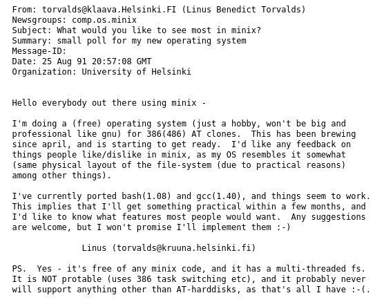

# Linux

**Linux** is an operating system (OS) just like [Windows](https://github.com/amirr0r/notes/tree/master/Windows#windows) or **macOS**. 

> An OS is a software that manages the whole communication between software and hardware.

Linux is **free** and **open-source**, the source code can be modified and distributed commercially or non-commercially by anyone.

> Open source software are not necessarily free!  

1. [A bit of history...](#a-bit-of-history)
2. [Distros (distributions)](#distros-distributions)
3. [Philosophy](#philosophy)


___

## A bit of history...

- **1970**: The history of Linux operating system (OS) began with the **Unix** operating system released by **Ken Thompson** and **Dennis Ritchie**, both of whom worked for **AT&T** at the **Bell Labs** research center at the time.

> Unix stand for Uniplexed Information and Computing Service. 

> Originally written in assembly language, but in 1973, Version 4 Unix was rewritten in C.

- **1977**: Berkeley Software Distribution (**BSD**) was released. Due to a lawsuit, against the University of California and Berkeley since BSD contained portions of Unix code owned by AT&T, the development of BSD encountered some issues.

- **1983**: **Richard Stallman**, from the **MIT**, started the **GNU** project. The goal was to propose a free and open source Unix-like operating system. Part of his work resulted in the creation of the `GNU General Public License` (GPL) a free software license.

- **1991**: The GNU kernel called Hurd, which unfortunately never came to completion. **Linus Torvalds**, a Finnish student, developed a new, free operating system kernel called **Linux** (initially just for a personal project).

> The kernel is the most important piece in the operating system. It allows the hardware to talk to the software.

These two projects were complementary: while Richard Stallman created the basic programs (`cp`,` rm`, `emacs`), Linus had embarked on the creation of the" heart "of an operating system: the core.

The GNU Project (free programs) and Linux (OS kernel) merged to create **GNU/Linux**.



> Linux was inspired by `Minix` which was inspired by `Unix` was inspired by `Multics`.

Linux kernel has gone from a small number of files written in C under licensing that prohibited commercial distribution to  [27.8 million source lines of code](https://www.linux.com/news/linux-in-2020-27-8-million-lines-of-code-in-the-kernel-1-3-million-in-systemd/) (for the latest version), licensed under the GNU General Public License v2.

Nowadays, Linux-based operating systems are installed on:
- servers
- desktops 
- mainframes
- embedded systems (routers, televisions, video game consoles, etc). 

**Android** which runs on 85% of smartphones and tablets is also based on the Linux kernel. 

Considering all these facts, Linux is, with no doubt, the most widely installed operating system!

> macOS ("OS X") is a Unix like operating system.

> The latest version of Windows supports Linux containers and [Windows Subsystem for Linux (WSL)](https://docs.microsoft.com/fr-fr/windows/wsl/).
___

## Distros (distributions)

A Linux distribution consists in an operating system based on the Linux kernel and supporting softwares and libraries.

There are many different distributions (distros). 

> A bit like a version of Windows.

**Debian**, **Ubuntu**, **Fedora**, **RedHat**, **Kali Linux**, **Arch Linux**, **Manjaro** and **Gentoo** are the most famous distros.

```
Linux
├── Debian
│   ├── Ubuntu
│   │  ├── Mint
│   ├── Kali Linux
├── openSUSE
├── Fedora
│   ├── Red Hat
│   │   ├── CentOS
├── Arch Linux
│   ├── Manjaro
│   ├── BlackArch
├── Gentoo
```

___

## Philosophy


___

## Structure


___

## Security


___

## Sources

- [**Wikipedia**: Unix](https://en.wikipedia.org/wiki/Unix)
- [**TED**: The mind behind Linux | Linus Torvalds](https://www.youtube.com/watch?v=o8NPllzkFhE)
- [Linuxjourney](https://linuxjourney.com/)
- [**HTB Academy**: Linux Fundamentals](https://academy.hackthebox.eu/course/preview/linux-fundamentals)
- [**ANSSI**: Recommandations de sécurité relatives à un système GNU/Linux](https://www.ssi.gouv.fr/guide/recommandations-de-securite-relatives-a-un-systeme-gnulinux/)
